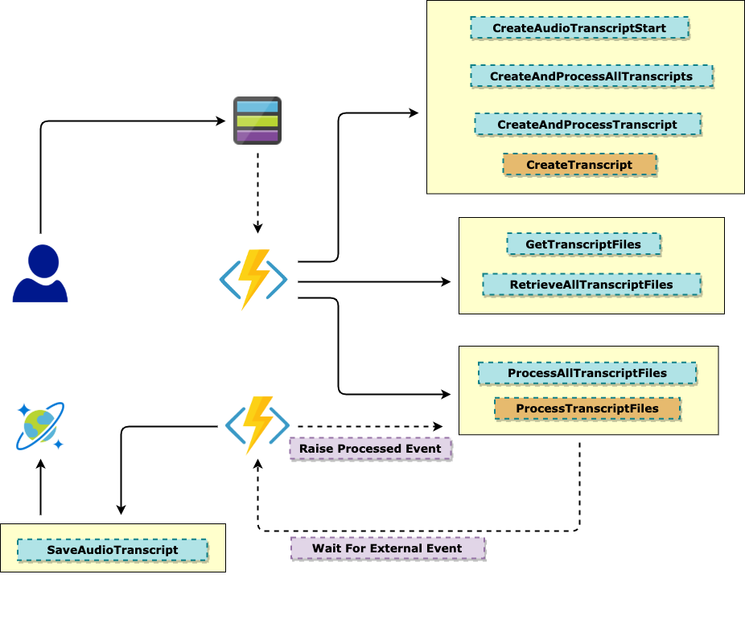
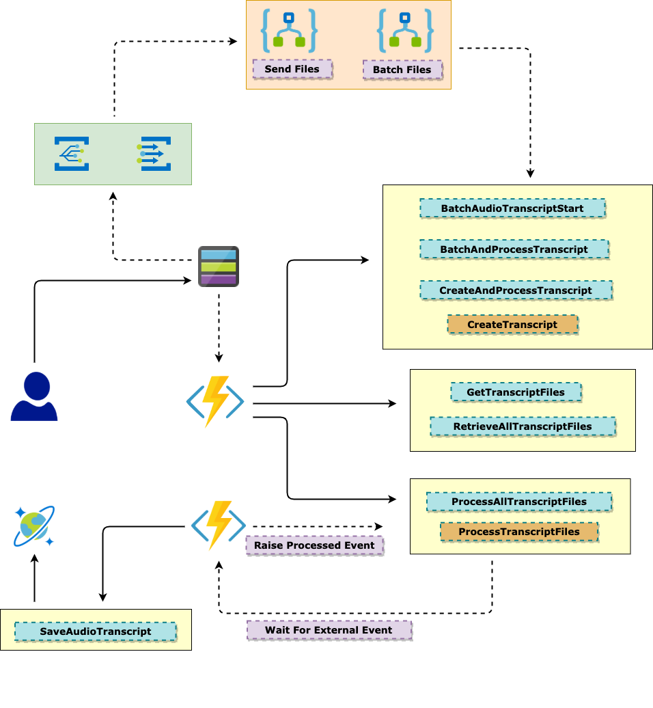

# ProcessAudioBlobApp

The purpose of this document is to provide an idea on how to implement an automated *Batch Transcript* process workflow for various Audio files using Azure Durable Function and/or Logic App.

Following are the two approaches described below:

- *Azure Durable Function* with *Blob* trigger to receive the audio file and then pass it thru multiple steps of transcript processing before creating the final file with transcript metadata
- A mix of of *Logic App* and *Azure Durable Function* would run through the same process workflow as above but would work upon a Batch of files - the batch would be created by Logic App flow and then past onto the Durable function for further processing; the workflow becomes same as above from there onwards

Let us delve into each one of these one by one

## Pre-Requisites

- Storage account for Azure Durable function

- Storage account for the Audio files to hold in a Blob Container - this account can be clubbed with the above account Or a new one can be created

- A Speech Service entry in Azure portal - this should return the API Key to be used by all API calls from within the functions

- A CosmosDB account, A Database and a Container - the final processed file(s) will be stored here as Json objects

- A local.settings.json file (***<u>this should not be checked into SCM</u>***)

  - We name it as tmp.local.settings.json and check this into SCM so that all team members can see the fields needed but not with any secured value shown - so our SCM would be happy!

  ```json
  {
      "IsEncrypted": false,
      "Values": {
          "AzureWebJobsStorage": "<AzureWebJobsStorage>",
          "BATCH_BLOB_CLIENT": "<BATCH_BLOB_CLIENT_CONN_STRING",
          "FUNCTIONS_WORKER_RUNTIME": "dotnet",
          "CREATE_TRANSCRIPT_URL": "https://eastus.api.cognitive.microsoft.com/speechtotext/v3.0/transcriptions",
          "GET_TRANSCRIPT_URL": "https://eastus.api.cognitive.microsoft.com/speechtotext/v3.0/transcriptions/{0}/files",
          "PROCESS_TRANSCRIPT_URL": "http://localhost:7071/api/SaveAudioTranscript",
          "Ocp-Apim-Subscription-Key": "<Ocp-Apim-Subscription-Key>",
          "First_Retry_Interval": 10,
          "Retry_TimeOut": 2,
          "Max_Number_Of_Attempts": 3,
          "Back_Off_Attempts": 2.0,
          "AUDIO_BLOB_DB_CONN_STRING": "<AUDIO_BLOB_DB_CONN_STRING>",
          "AUDIO_BLOB_DB_DATABASE_ID": "<DATABASE_ID>",
          "AUDIO_BLOB_DB_CONTAINER_ID": "<CONTAINER_ID>"
      }
  }
  ```

  

## Approach 1 - <u>Durable Function flow</u>



### Blob Trigger

Blob trigger function with an initialised Orchestrator client argument. This client will be responsible for initiation of an Orchestrator function which subsequently initiates the app flow. This also creates an *AudioModel* object which holds metadata information about the Blob - *Uri, Name, Container Name* etc.

```c#
[FunctionName("CreateAudioTranscriptStart")]
public static async Task CreateAudioTranscriptStartAsync([BlobTrigger("audioblob/{name}")]
                                                         CloudBlockBlob cloudBlockBlob,
                                                         [Blob("audioblob/{name}",
                                                         FileAccess.ReadWrite)]
                                                         byte[] blobContents,
                                                         [DurableClient]
                                                         IDurableOrchestrationClient starter,
                                                         ILogger logger)
{

  var audioModel = new AudioModel()
  {

    AudioUri = cloudBlockBlob.Uri.AbsoluteUri,
    AudioName = cloudBlockBlob.Name,
    ContainerName = cloudBlockBlob.Container.Name,
    IsBatch = false

  };          

  string instanceId = await starter.StartNewAsync("CreateAndProcessAllTranscripts", audioModel);
  logger.LogInformation($"Started orchestration with ID = '{instanceId}'.");
  
}
```

### Orchestrator Function

Receives Blob images through *OrchestrationTrigger* from *OrchestrationClient* of the startup function (*previous step*). This function would then pass on the metadata (*AudioModel*) object to another SubOrchestrator function - *CreateAndProcessTranscript* for Creation and processing of Transcripts

```c#
[FunctionName("CreateAndProcessAllTranscripts")]
public static async Task CreateAndProcessAllTranscriptsAsync([OrchestrationTrigger]
                                                             IDurableOrchestrationContext
                                                             context,
                                                             ILogger logger)
{

  var audioModel = context.GetInput<AudioModel>();
  await context.CallSubOrchestratorAsync("CreateAndProcessTranscript", audioModel);

}
```

### SubOrchestrator Function

Receives the audio model 

```C#
public static async Task CreateAndProcessTranscriptAsync([OrchestrationTrigger]
                                                         IDurableOrchestrationContext
                                                         context, ILogger logger)
{

  var audioModel = context.GetInput<AudioModel>();
  var transcriptModel = await context.CallActivityAsync<TranscriptModel>
    ("CreateTranscript", audioModel);
  var transcriptCodeString = GetTranscriptCode(transcriptModel);
  var transcriptCodeModel = new TranscriptCodeModel()
  {
    InstanceId = context.InstanceId,
    TranscriptCode = transcriptCodeString

  };

  var transcriptsList = await context.CallSubOrchestratorAsync<List<TranscriptModel>>
    ("GetTranscriptFiles", transcriptCodeModel);

  var transcriptModels = new TranscriptModels()
  {

    InstanceId = context.InstanceId,
    Transcripts = transcriptsList

  };

  await context.CallSubOrchestratorAsync("ProcessAllTranscriptFiles", transcriptModels);
  using (var cts = new CancellationTokenSource())
  {

    var dueTime = context.CurrentUtcDateTime.AddMinutes(3);
    var timerTask = context.CreateTimer(dueTime, cts.Token);
    var processedTask = context.WaitForExternalEvent<bool>("Processed");
    var completedTask = await Task.WhenAny(processedTask, timerTask);
    var isProcessed = processedTask.Result;

    if (isProcessed == true)
      logger.LogInformation("Processsed");
    else
      logger.LogInformation("Not yet");

  }
}
```

Creates the Transcript Model using Cognitive API

```C#
var transcriptModel = await context.CallActivityAsync<TranscriptModel>("CreateTranscript", audioModel);	
```

Extract Transcript Code string and then calls the Cognitive API to get the details of the Transcript

```C#
var transcriptCodeString = GetTranscriptCode(transcriptModel);
var transcriptCodeModel = new TranscriptCodeModel()
{
  InstanceId = context.InstanceId,
  TranscriptCode = transcriptCodeString

};

var transcriptsList = await context.CallSubOrchestratorAsync<List<TranscriptModel>>("GetTranscriptFiles", 																																											transcriptCodeModel);
```

Processes the Transcript files obtained in the previous step

```C#
var transcriptModels = new TranscriptModels()
{

  InstanceId = context.InstanceId,
  Transcripts = transcriptsList

};

await context.CallSubOrchestratorAsync("ProcessAllTranscriptFiles", transcriptModels);
```

Waits for the Processing to happen. The processing would be performed by a separate function and then it would raise the Processed event; which then brings the following code to release from the wait and close the entire flow. Also, please note that, the wait is  configured for a 3 minutes timer too. So, between timer and External event - whichever forces forts would win and the flow would continue with *success* or *failure*

```C#
using (var cts = new CancellationTokenSource())
{

  var dueTime = context.CurrentUtcDateTime.AddMinutes(3);
  var timerTask = context.CreateTimer(dueTime, cts.Token);
  var processedTask = context.WaitForExternalEvent<bool>("Processed");
  var completedTask = await Task.WhenAny(processedTask, timerTask);
  var isProcessed = processedTask.Result;

  if (isProcessed == true)
    logger.LogInformation("Processsed");
  else
    logger.LogInformation("Not yet");

}
```


#### CreateTranscript

```C#
[FunctionName("CreateTranscript")]
public static async Task<TranscriptModel> CreateTranscriptAsync([ActivityTrigger]
                                                                AudioModel audioModel)
{

  var audioSaStokenString = GetAudioSaSToken(audioModel);
  var transcriptReqestModel = new TranscriptRequestModel()
  {

    ContentUrls = new List<string>()
    {

      audioSaStokenString

    },

    Properties = new TranscriptProperties()
    {

      DiarizationEnabled = false,
      WordLevelTimestampsEnabled = false,
      PunctuationMode = "DictatedAndAutomatic",
      ProfanityFilterMode = "Masked"

    },

    Locale = "en-US",
    DisplayName = "Transcription using default model for en-U"


  };

  var createTranscriptURL = Environment.GetEnvironmentVariable("CREATE_TRANSCRIPT_URL");
  var apiKeyString = Environment.GetEnvironmentVariable("Ocp-Apim-Subscription-Key");
  kHttpClient.DefaultRequestHeaders.Add("Ocp-Apim-Subscription-Key", apiKeyString);

  var transcriptContentString = JsonConvert.SerializeObject(transcriptReqestModel);
  var content = new StringContent(transcriptContentString);
  content.Headers.ContentType = new MediaTypeHeaderValue("application/json");

  var transcriptResponse = await kHttpClient.PostAsync(createTranscriptURL, content);
  var createdTranscript = await transcriptResponse.Content.ReadAsStringAsync();
  var transcriptModel = JsonConvert.DeserializeObject<TranscriptModel>(createdTranscript);
  return transcriptModel;

}
```


#### GetTranscriptFiles

```C#
[FunctionName("GetTranscriptFiles")]
public static async Task<List<TranscriptModel>> GetTranscriptFilesAsync([OrchestrationTrigger]
                                                                        IDurableOrchestrationContext context,                                                        
                                                                        ILogger logger)
{


  var transcriptCodeModel = context.GetInput<TranscriptCodeModel>();
  var retryOptions = GetRetryOptions();
  var transcriptsList = await context.CallActivityWithRetryAsync<List<TranscriptModel>>
    ("RetrieveAllTranscriptFiles", retryOptions,
     transcriptCodeModel.TranscriptCode);
  return transcriptsList;

}
```


#### RetrieveAllTranscriptFiles and RetrieveTranscriptFilesAsync

The loop here is to make sure that GetTranscript is successful; so after Creating a transcript, the Cognitive system might take some time to process the files in the blob and Getting the transcript - hence loop would add a 3 seconds delay and continue to see if the Transcript data is available or not

```C#
private static async Task<List<TranscriptModel>>
                             RetrieveTranscriptFilesAsync(string transcriptCodeString)
{

  if (transcriptCodeString.Equals(string.Empty) == true)
    return null;

  var getTranscriptURLString = Environment.GetEnvironmentVariable("GET_TRANSCRIPT_URL");
  getTranscriptURLString = string.Format(getTranscriptURLString, transcriptCodeString);

  var apiKeyString = Environment.GetEnvironmentVariable("Ocp-Apim-Subscription-Key");
  kHttpClient.DefaultRequestHeaders.Add("Ocp-Apim-Subscription-Key", apiKeyString);

  var getTranscriptFilesResponse = await kHttpClient.GetAsync(getTranscriptURLString);
  var transcriptFileModelsString = await getTranscriptFilesResponse.Content.ReadAsStringAsync();
  var transcriptFileModels = JsonConvert.DeserializeObject<TranscriptModels>
    (transcriptFileModelsString);
  var transcriptFilesList = transcriptFileModels.Transcripts;
  return transcriptFilesList;

}

[FunctionName("RetrieveAllTranscriptFiles")]
public static async Task<List<TranscriptModel>> RetrieveAllTranscriptFilesAsync(
  [ActivityTrigger]
  string transcriptCodeString)
{

  if (transcriptCodeString.Equals(string.Empty) == true)
    return null;

  List<TranscriptModel> transcriptFilesList = null;
  do
  {

    transcriptFilesList = await RetrieveTranscriptFilesAsync(transcriptCodeString);
    await Task.Delay(TimeSpan.FromSeconds(3));

  } while (transcriptFilesList.Count <= 1);

  return transcriptFilesList;

}
```


#### ProcessAllTranscriptFiles and ProcessTranscriptFiles

- ProcessAllTranscriptFiles is a *SubOrchestrator* function 
- ProcessTranscriptFiles is an *Activity* Function

```c#
[FunctionName("ProcessTranscriptFiles")]
public static async Task ProcessTranscriptFilesAsync([ActivityTrigger] TranscriptModels transcriptModels)
{

  if (transcriptModels == null)
    return;

  var transcriptFilesList = transcriptModels.Transcripts;
  if (transcriptFilesList.Count <= 1)
    return;

 	var processedFilesList = transcriptFilesList.Where((TranscriptModel transcriptModel) =>
  {
      return (transcriptModel.Kind.Equals("Transcription") == true);
  }).ToList();

  var processedModels = new TranscriptModels()
  {

    InstanceId = transcriptModels.InstanceId,
    Transcripts = processedFilesList

  };

  var processedModelsString = JsonConvert.SerializeObject(processedModels);
  var content = new StringContent(processedModelsString);
  content.Headers.ContentType = new MediaTypeHeaderValue("application/json");

  var processTranscriptURL = Environment.GetEnvironmentVariable("PROCESS_TRANSCRIPT_URL");
  await kHttpClient.PostAsync(processTranscriptURL, content);

}

[FunctionName("ProcessAllTranscriptFiles")]
public static async Task ProcessAllTranscriptFilesAsync([OrchestrationTrigger]IDurableOrchestrationContext 																													context, ILogger logger)
{

  var transcriptModels = context.GetInput<TranscriptModels>();
  var retryOptions = GetRetryOptions();
  await context.CallActivityWithRetryAsync("ProcessTranscriptFiles", retryOptions,
                                           transcriptModels);

}
       
```


#### GetAudioSaSToken

This is to generate the Shared Access Token with a specified time interval (*30 mins*) to access the blob url. Cognitive API would then be able to call this url and perform all Transcript operations

```C#
private static string GetAudioSaSToken(AudioModel audioModel)
{

  if (audioModel == null)
    return null;

  var clockSkew = TimeSpan.FromMinutes(15d);
  var accessDuration = TimeSpan.FromMinutes(15d);

  var audioSaS = new SharedAccessBlobPolicy()
  {

    Permissions = SharedAccessBlobPermissions.Read,
    SharedAccessStartTime = DateTime.UtcNow.Subtract(clockSkew),
    SharedAccessExpiryTime = DateTime.UtcNow.Add(accessDuration) + clockSkew

  };

  var cloudBlobClient = (audioModel.IsBatch == true)
    ? kCloudBatchBlobClient : kCloudBlobClient;

  var container = cloudBlobClient.GetContainerReference(audioModel.ContainerName);
  var blob = container.GetBlockBlobReference(audioModel.AudioName);

  var sasTokenString = blob.GetSharedAccessSignature(audioSaS);
  sasTokenString = string.Concat(audioModel.AudioUri, sasTokenString);
  return sasTokenString;

}
```


#### GetRetryOptions

This allows the Activity and Orchestrator/SubOrchestrator functions to retry automatically while calling the Cognitive APIs. Especially during a peak load, if the APIs return 429 or throttling error then this Retry option might be the saviour

```C#
private static RetryOptions GetRetryOptions()
{

  int.TryParse(Environment.GetEnvironmentVariable("First_Retry_Interval"),
               out int firstRetryInterval);

  int.TryParse(Environment.GetEnvironmentVariable("Retry_TimeOut"),
               out int retryTimeout);

  int.TryParse(Environment.GetEnvironmentVariable("Max_Number_Of_Attempts"),
               out int maxNumberOfAttempts);

  double.TryParse(Environment.GetEnvironmentVariable("Back_Off_Attempts"),
                  out double backOffCoefficient);

  var retryOptions = new RetryOptions(TimeSpan.FromSeconds(firstRetryInterval),
                                      maxNumberOfAttempts)
  {
    BackoffCoefficient = backOffCoefficient,
    RetryTimeout = TimeSpan.FromMinutes(retryTimeout)               

  };

  return retryOptions;

}
```


### SaveAudioTranscript

- This is durable function to save the processed data onto *Azure CosmosDB*
- SaveTranscriptAsync is the helper function that asynchronously save the data in the DB

```C#
private static async Task<HttpStatusCode> SaveTranscriptAsync(ProcessedModel processedModel)
{

  if (processedModel == null)
    return HttpStatusCode.BadRequest;

  var databaseId = Environment.GetEnvironmentVariable("AUDIO_BLOB_DB_DATABASE_ID");
  var containerId = Environment.GetEnvironmentVariable("AUDIO_BLOB_DB_CONTAINER_ID");

  var container = kCosmosClient.GetContainer(databaseId, containerId);
  var insertResponse = await container.CreateItemAsync(processedModel,
                                                       new PartitionKey
                                                       (processedModel.SourceId));
  return (insertResponse.StatusCode);

}

[FunctionName("SaveAudioTranscript")]
public static async Task SaveAudioTranscriptAsync(
  [HttpTrigger(AuthorizationLevel.Anonymous, "post", Route = null)]
  HttpRequestMessage requestMessage,
  [DurableClient] IDurableOrchestrationClient client, ILogger logger)
{

  var body = await requestMessage.Content.ReadAsStringAsync();
  if (body == null)
    new BadRequestObjectResult("Bad Request") { StatusCode = 400 };

  var transcriptModels = JsonConvert.DeserializeObject<TranscriptModels>(body);
  if (transcriptModels == null)
    new BadRequestObjectResult("Bad Request") { StatusCode = 400 };

  var transcriptFilesList = transcriptModels.Transcripts;
  var taskList = transcriptFilesList.Select(async (TranscriptModel transcriptModel) =>
	{

      var uri = transcriptModel.Links.ContentUrl;
      var fileContentString = await kHttpClient.GetStringAsync(uri);

      var processedModel = JsonConvert.DeserializeObject<ProcessedModel>(fileContentString);
      processedModel.SourceId = Guid.NewGuid().ToString();

      var responseCode = await SaveTranscriptAsync(processedModel);
      logger.LogInformation(responseCode.ToString());

  }).ToList();

  await Task.WhenAll(taskList);
  await client.RaiseEventAsync(transcriptModels.InstanceId, "Processed", true);

}
```


## Approach 2 - <u>Durable Function + Logic App flow</u>




1. Audio is uploaded in the Blob

2. The Event Grid subscription to the *Send Files* logic app is triggered

3. *Send Files* Logic App keeps on receiving each new audio file added to Blob

4. It then sends this to *Receive Files* logic app - each file one by one

5. *Receive Files* logic app can be configured to form a batch of files - by the *MessageCount* property

6. Once the *MessageCount* property reaches a particular value, a batch is formed and moves to next step for further processing (7)

7. It then send the batched data to a the Durable function - *BatchAudioTranscriptStart* and from their onward entire flow remains same as the **Approach 1**

   

#### BatchAudioTranscriptStart

This accepts the 

```C#
[FunctionName("BatchAudioTranscriptStart")]
public static async Task<IActionResult> BatchAudioTranscriptStartAsync(
  [HttpTrigger(AuthorizationLevel.Anonymous,
               "post", Route = null)]
  HttpRequestMessage request,
  [DurableClient] IDurableOrchestrationClient starter,
  ILogger logger)
{

  var body = await request.Content.ReadAsStringAsync();
  logger.LogInformation(body);

  var batchURIs = JsonConvert.DeserializeObject<List<string>>(body);            
  if ((batchURIs == null) || (batchURIs.Count == 0))
    return new BadRequestObjectResult("Bad Request") { StatusCode = 400 };

  var audioModelsList = new List<AudioModel>();
  batchURIs.ForEach((string batchURIString) =>
  {

    var tokensArray = batchURIString.Split("/");
    var fileNameString = tokensArray[tokensArray.Length - 1];
    var containerNameString = tokensArray[tokensArray.Length - 2];

    var audioModel = new AudioModel()
    {
      AudioUri = batchURIString,
      AudioName = fileNameString,
      ContainerName = containerNameString,
      IsBatch = true

    };

    audioModelsList.Add(audioModel);

  });
  
  string instanceId = await starter.StartNewAsync("BatchAndProcessTranscript", audioModelsList);
  logger.LogInformation($"Started orchestration with ID = '{instanceId}'.");

  return new OkObjectResult("OK") { StatusCode = 200 };

}
```


#### BatchAndProcessTranscript

Calls *CreateAndProcessTranscript* sub orchestrator function and processes all files in a batch

```C#
[FunctionName("BatchAndProcessTranscript")]
public static async Task BatchAndProcessTranscriptAsync([OrchestrationTrigger]
                                                        IDurableOrchestrationContext
                                                        context, ILogger logger)
{

  var audioModelsList = context.GetInput<List<AudioModel>>();
  var taskList = audioModelsList.Select(async (AudioModel audioModel) =>
	{
		await context.CallSubOrchestratorAsync("CreateAndProcessTranscript", audioModel);
  }).ToList();

  await Task.WhenAll(taskList);

}
```


=================================X======================================